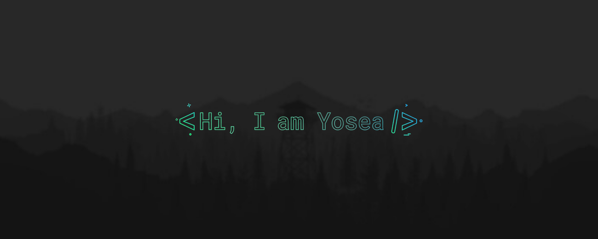
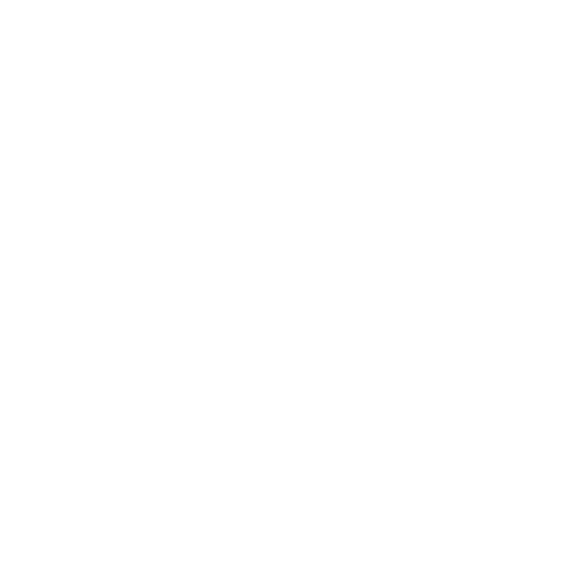

  
  
  

---

   
  <b>About Me</b>
    
  

    Hello there! I'm <b>Yosea Mervandy Sugiarto</b>, a Software Developer and a recent Informatics Engineering graduate from Telkom University Purwokerto. I enjoy learning new technologies and solving problems through code. Currently, I'm working on a few fun side projects to put my knowledge of Kotlin, React, Bootstrap, and more into practice.
  

   
  <b>Tech Stack</b>
    
  
  
  
  
  
  
  
  
  
  
  
  
  
  
  

---

   
  <b>Github Stats</b>
    
  
  &nbsp;&nbsp;
  
    
  

---